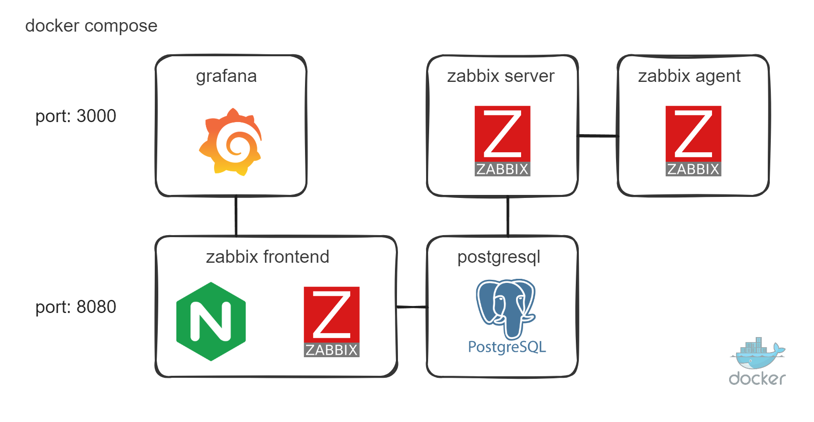

# docker compose - Zabbix NGINX PostgreSQL + Grafana

For those who are used to collecting metrics in Zabbix but want to build more visually appealing dashboards in Grafana.  
This repository provides a straightforward `docker-compose.yml` setup with the following components:

- **PostgreSQL**: 16-alpine  
- **Zabbix Server**: 7.2.1  
- **Zabbix Frontend (NGINX)**: 7.2.1  
- **Zabbix Agent**: 7.2.1  
- **Grafana**: 11.4.0  

## Table of Contents

1. [Overview](#overview)  
2. [Prerequisites](#prerequisites)  
3. [Installation](#installation)  
4. [Configuration](#configuration)  
   - [Environment Variables](#environment-variables)  
   - [Zabbix Agent Host Setup](#zabbix-agent-host-setup)  
   - [Ports](#ports)  
5. [Accessing the Services](#accessing-the-services)  
   - [Zabbix Frontend](#zabbix-frontend)  
   - [Grafana](#grafana)  
6. [Debug and Logs](#debug-and-logs)  
7. [Additional Notes](#additional-notes)

---

## Overview

This setup runs a full Zabbix stack on top of **PostgreSQL** and **NGINX**, alongside **Grafana**. Zabbix handles data collection from the built-in Zabbix Agent (running in a container), while Grafana provides a user-friendly and customizable dashboard solution. The `zabbix-agent` is configured to connect to the Zabbix Server container.



---

## Prerequisites

- **Docker** (version 20+ recommended)  
- **Docker Compose** (v2 or classic v1.29+)

Make sure both are correctly installed on your system.  

---

## Installation

1. **Clone the repository**:
   ```bash
   git clone https://github.com/AxlMrt/zabbix-docker.git
   cd zabbix-docker
   ```

2. **Check or modify the `.env` file** to suit your needs (database credentials, ports, paths, etc.).  

3. **Launch the containers**:
   ```bash
   docker-compose up -d
   ```
   The first startup may take a couple of minutes while images are downloaded and initialized.

---

## Configuration

### Environment Variables

In the `.env` file, you can set various environment variables such as database credentials, service ports, and more. By default:
- `POSTGRES_USER`, `POSTGRES_PASSWORD`, and `POSTGRES_DB` define how the PostgreSQL container is provisioned.
- Zabbix and Grafana containers will pick up credentials from these variables to connect to the database or each other.

### Zabbix Agent Host Setup

Inside Zabbix, the default host uses the DNS name `zabbix-agent` for data collection. This corresponds to the service name in Docker Compose. If you want to monitor more than the container itself (e.g., your Docker host), you may need to configure the agent differently (such as using network mode `host` or adjusting items within Zabbix).

### Ports

By default, the following container ports are exposed:

- **Zabbix Frontend (NGINX)**: `8080` on the host -> `80` inside the container  
- **Grafana**: `3000` on the host -> `3000` inside the container  
- **Zabbix Server**: `10051` (for inbound connections from agents/proxies)  
- **PostgreSQL**: `5432` (internal only, not exposed to host by default in this example)

Feel free to change these in the `docker-compose.yml` if needed.

---

## Accessing the Services

### Zabbix Frontend

- **URL**: [http://localhost:8080](http://localhost:8080) (or use the server IP instead of `localhost` if running remotely)
- **Default Credentials**:  
  - **Username**: `Admin`  
  - **Password**: `zabbix`  

On first login, Zabbix will guide you through any initial configuration steps. You can change the admin password under *Administration -> Users*.

**Important**: Verify that the Zabbix server is properly connected to PostgreSQL.  
You can check *Configuration -> Hosts* to see if the built-in `zabbix-agent` host is listed and *enabled*.

### Grafana

- **URL**: [http://localhost:3000](http://localhost:3000)  
- **Default Credentials**:  
  - **Username**: `admin`  
  - **Password**: `12345`  

Once logged in, you can add your data source for Zabbix:  
1. Go to **Connections** -> **Data Sources** -> **Add Data Source**.  
2. Choose **Zabbix** plugin.  
3. Enter the URL pointing to your Zabbix frontend API (e.g., `http://zabbix-frontend/api_jsonrpc.php` if using service DNS in Docker, or `http://localhost:8080/api_jsonrpc.php` if accessing from host).  
4. Provide the same credentials as in the Zabbix Web UI.  
5. Click **Test**. If successful, you’re ready to import or build dashboards in Grafana.

---

## Debug and Logs

To view container logs in real-time:

```bash
docker-compose logs --tail=50 -f
```

Or individually, e.g.:

```bash
docker-compose logs -f zabbix-server
docker-compose logs -f grafana
```

This helps diagnose any startup or connectivity issues.

---

## Additional Notes

1. **Data Persistence**:  
   - PostgreSQL data is stored in a volume so it won’t be lost on container restarts.  
   - If you remove containers and volumes, you’ll lose your historical metrics unless you back up the database.

2. **Security**:  
   - Change the default passwords for Zabbix (`Admin` user) and Grafana (`admin` user) immediately.  
   - Consider configuring SSL/TLS if you plan to expose these services publicly.

3. **Customization**:  
   - You can adjust the environment variables in `.env` or directly in the `docker-compose.yml` to match your needs (e.g., using a custom domain, different ports, or advanced Zabbix/Grafana settings).  
   - For more advanced configurations, refer to the [Official Zabbix Dockerfiles](https://github.com/zabbix/zabbix-docker) and [Grafana documentation](https://grafana.com/docs/).

---

**Happy monitoring and dashboarding!** If you have any questions or run into issues, feel free to open an issue on the repository.
